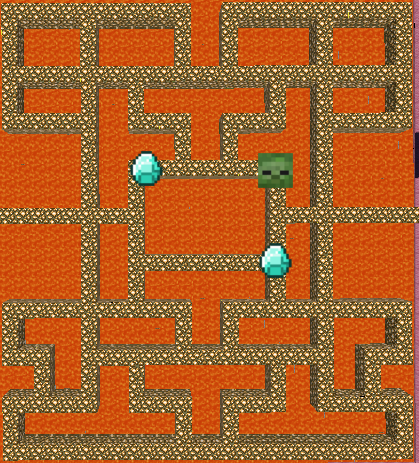
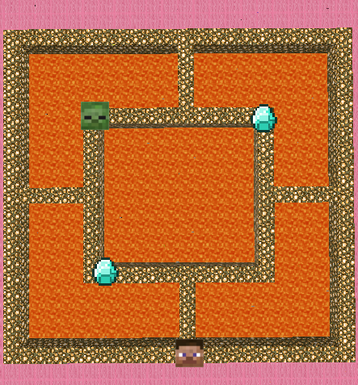
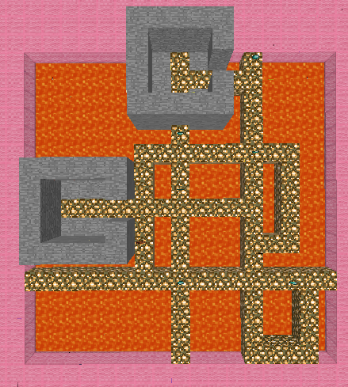
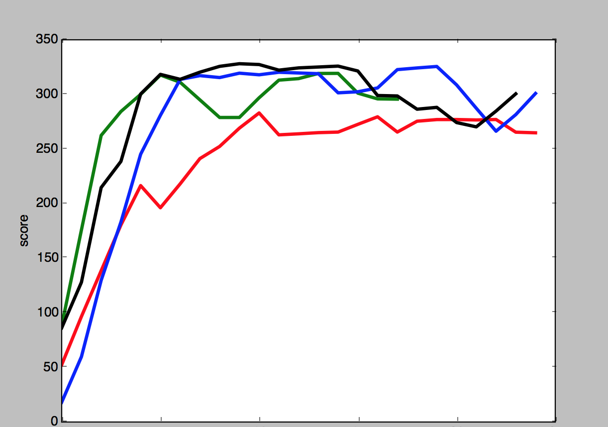
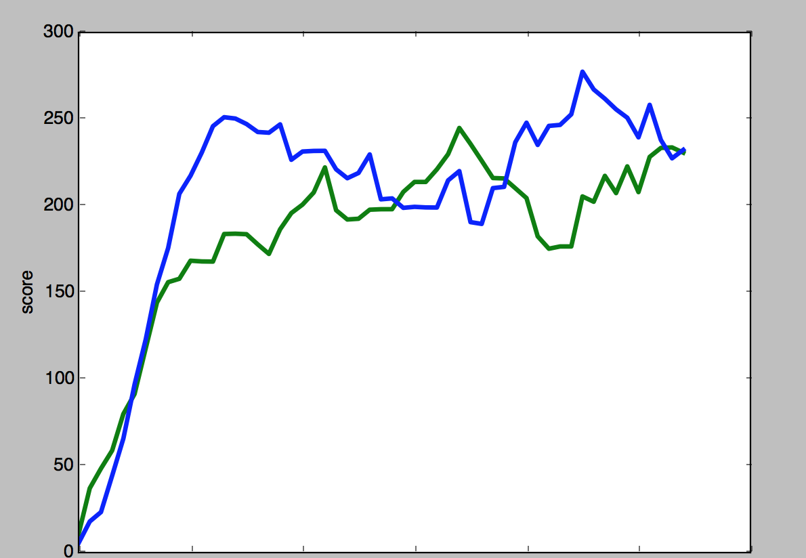
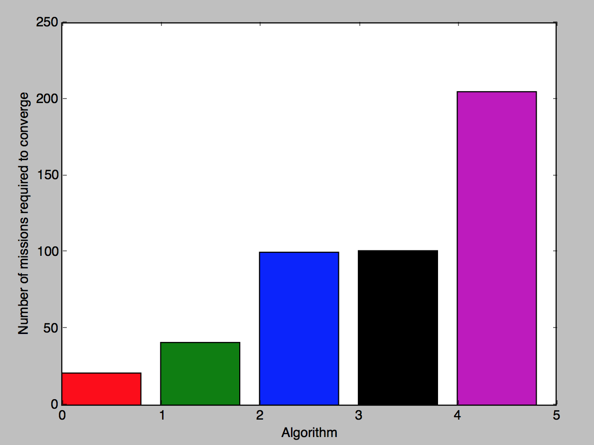
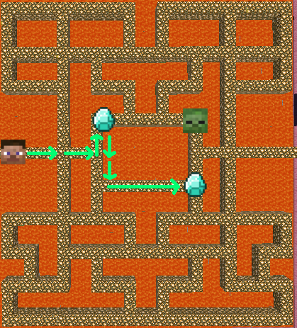

## Final Report
_Last Modified June 11, 2017_

### Video
<div id="video_frame">
  <iframe src="https://www.youtube.com/embed/sS253RfbM3s" frameborder="0" allowfullscreen></iframe>
</div>

### Project Summary
This project teaches an agent to navigate a contained but hostile environment. The agent must navigate a maze of glowstone blocks, collecting diamonds scattered around the maze, and avoiding zombies. Essentially, the agent learns to play PacMan. The more diamonds the agent gets, and the longer it survives, the higher its score. The agent learns to maximize its score using a number of different local search algorithms. We then compare the performance of each algorithm, to illuminate the strengths and weaknesses of each.

_A priori_, there is no obvious best path through the maze. Local search algorithms provide a means of finding an optimal path in far less time than it would take to iterate through all possibilities by brute force. Indeed, the search algorithms we have employed are able to converge on good strategies relatively quickly, though the means by which they discover that strategy vary.

The primary goal of this project is to gather data with which we can compare different local search algorithms. To that end, we have tested several local search algorithms in three environments of different complexities. In particular, we have tested a genetic algorithm, a steep hill-climbing algorithm, a greedy hill-climbing algorithm, and a simulated annealing algorithm within these environments against the baseline performance of a brute force algorithm. The results of our tests are presented below.

<table class="comparison" style="max-width: 1024px;">
    <tr>
        <td></td>
        <td></td>
        <td></td>
    </tr>
    <tr>
        <td colspan="3">
            <br />
            <em>Mazes in which the agent was trained.</em>
        </td>
    </tr>
</table>

### Approach
Each algorithm relies on the same set of heuristics functions to navigate the environment. These heuristic functions take as input the agent's observations, and output a move that the agent will take. The agent's observations include the following information:

* `grid`: a 3x3 grid of blocks centered at the block below the agent's feet
* `entity_locations`: the location, in Minecraft's XYZ space, of every entity in the map, including the player, and every enemy and diamond

So far, the algorithms employ the following heuristic functions:

* `random_direction`: the agent moves in a random direction
* `away_from_enemy`: the agent moves away from the nearest zombie
* `towards_item`: the agent moves towards the nearest diamond

At each junction in the maze, the algorithm decides which heuristic function to use, and then returns the movement action generated by the heuristic. The agent then takes that action. Once the mission is complete, the agent's score is evaluated. The score is a function of the number of diamonds that the agent has collected, and the amount of time in seconds $$t$$ that the agent stayed alive. The number of diamonds collected dominates the score function. The time alive is largely included to make the score continuous, such that the agent's progress can be measured even when performance increases only marginally. Specifically, the score is calculated as:

$$ score = diamonds \cdot 50 + t $$

A mission ends when the agent has died, or automatically after 30 seconds. The score is then fed to the algorithm, which considers the score and then updates its heuristic selection function appropriately. Each algorithm has the following three functions defined in its interface:

* `__init__:` the algorithm's constructor, which takes in a list of heuristic functions that it can use
* `process_score:` informs the algorithm of the score it achieved on the latest mission. The algorithm then decides at what level this score should be logged (see the *Evaluation* section below for more information)
* `get_action`: returns the next move that the agent should take

We have implemented various kinds of algorithms. They work as follows:  

#### Genetic Algorithm
The genetic algorithm creates a "generation" of strings of heuristic functions. Each generation contains 20 strings. The length of the strings is determined randomly by a normal distribution with $$\mu = 8$$ and $$\sigma = 1$$. Every mission, the agent relies on the heuristic strings to determine where to move. For each move, it looks to the next heuristic in the string, and takes the move generated by that heuristic. If the agent reaches the end of the string, it starts over at the beginning of the string.

After each mission, the algorithm is updated with the score that the agent received. When the agent has gone through all strings in a generation, the algorithm takes the top 5 most high-scoring strings, and generates 20 new strings. It generates the new strings by randomly selecting from the most high-scoring strings, and then combining them at a randomly chosen crossover point. Additionally, there is a probability $$p = .05$$ that a given heuristic in a string will "mutate" into a different heuristic. The algorithm continues to repeat this process with the new generation, ideally attaining higher scores each time.  

```python
# pseudocode for the creation of a new population
fittest = five top scoring strings within the population

for i in range(population_size):
  parent1 = random.choice(fittest)
  parent2 = random.choice(fittest)

  child = parent1[crossover:] + parent2[:crossover]
  for heuristic in child:
    5% chance to mutate heuristic to another one
  population.append(child)
```

#### Steep Hill-Climbing Algorithm
Like the genetic algorithm, the hill-climbing algorithm operates on a string of heuristic functions. First, the hill-climbing algorithm runs a mission using one of these strings. As with the genetic algorithm, the agent looks to the next heuristic in the string to determine what move it should make. If it reaches the end of the string, it starts over at the beginning of the string.

After this first string has been scored, the algorithm then runs a mission for each string adjacent to the string in the search space. An adjacent string is a string differing by only one addition of a heuristic from the string, removal of a heuristic, or change of a heuristic. After scoring every adjacent string, the algorithm chooses the string with the best score. It then explores the adjacent strings to that string, choosing the best one of those, and so on. These incremental improvements allow the algorithm to find heuristic strings that produce higher and higher scores.

```python
#pseudocode for steep hill-climbing
while True:
  for string adjacent to current_string:
    if score(string) > score(current_string):
      best_string = string

  current_string = best_string
```

#### Greedy Hill-Climbing Algorithm
The greedy hill-climbing algorithm is similar to the steep hill-climbing algorithm. However, instead of examining every neighboring string and choosing the best one, the moment if finds it an adjacent hill-climbing string with better performance than the current string, it switches to using that one. In other words, whereas the steep hill-climbing algorithm searches for the highest-scoring neighbor, the greedy hill-climbing algorithm searches for the first neighbor it finds that improves the agent's score.

```python
#pseudocode for greedy hill-climbing
while True:
  for string adjacent to current_string:
    if score(string) > score(current_string):
      current_string = string
      break
```

#### Simulated Annealing
The simulated annealing algorithm is similar to the hill-climbing algorithm, however, it does not always choose the highest-scoring neighbor. Instead, there is a possibility that the algorithm will deliberately choose a suboptimal neighbor. The probability that the algorithm will choose a suboptimal neighbor decreases over time, as the algorithm gets closer and closer to an optimal heuristic string. The purpose of this probabilistic behavior is to maximize the space that the hill-climbing algorithm explores. Rather than sticking with whatever seems locally optimal, the hill-climbing algorithm may find even better strings in areas of the search space that, at first glance, seemed sub-optimal.

```python
#pseudocode for simulated annealing in the steep hill-climbing algorithm
while True:
  p = probability that we choose a suboptimal choice
  eps = random.random()

  neighbors = every string adjacent to current_string

  if eps < p:
    string = random.choice(neighbors)
  else:
    for string adjacent to current_string:
      if score(string) > score(current_string):
        best_string = string

    current_string = best_string

  p *= 0.5
```

#### Brute Force
We use a brute force algorithm to provide a baseline against which we can compare the performance of other algorithms. The Brute Force runs a mission using every heuristic string of a given length, and then reports back on the best score for a string of that length. It then examines all strings one heuristic longer than that, repeating the process indefinitely. This algorithm therefore comprehensively (and therefore inefficiently) examines all possible heuristic strings.

```python
#pseudocode for brute force algorithm
i = 1
while True:
  best_score = 0
  best_string = []

  for every string of length i:
    if score(string) > best_score:
      best_score = score(string)
      best_string = string

  i += 1
```

### Evaluation
As the goal of this project is to provide comparative data about different local search algorithms, this project should be evaluated on the basis of the quality of data it provides. Since our status report, we substantially improved the level of detail in the data that we gather from the project. This has unlocked new methods by which we can quantitatively analyze and compare the performance of the various algorithms.

Previously, our program logged the score that the agent received at the end of every mission. Now, the logging format is more complex. After each mission, the algorithm can decide to log one or more scores. The algorithm also logs the heuristic string associated with each score, as well as an integer logging level. The lower the logging level, the more important the score.

The logging level helps filter out scores that provide less insight into the algorithm's performance, thus substantially reducing the amount of noise in the data. For example, the genetic algorithm logs all scores for all strings at level 1, but also logs the scores for the best-scoring strings within each population at level 0. This helps us distinguish between an algorithm's ability to locate good strings, and the algorithm's performance when it is spending time in a more exploratory phase. Every algorithm logs every score at level 1, but additionally will log "important" scores at level 0. The logging behavior for all algorithms is as follows:

* **Genetic Algorithm:** logs the scores for the highest-scoring members of each generation at level 0.
* **Hill-Climbing / Annealing Algorithms:** logs the scores for each string that causes the algorithm to switch its `current_string` at level 0.
* **Brute Force Algorithm:** logs the scores for the best string of a given length at level 0.

Showing only those results logged at level 0, we can clearly see that the algorithms quickly converge to optimal results. This graph shows a plot of the scores logged at level 0 by each algorithm on the Y axis, with time increasing along the X axis:


<div style="margin-left: auto; margin-right: auto; text-align: center; width: 250px;">
    <strong>Legend</strong>
    <ul style="text-align: left;">
        <li style="color: #F00;">Genetic Algorithm</li>
        <li style="color: #0C0;">Steep Hill-Climbing Algorithm</li>
        <li style="color: #00F;">Greedy Hill-Climbing Algorithm</li>
        <li style="color: #000;">Simulated Annealing</li>
    </ul>
</div>

Note that this graph should not be taken as a literal plot of scores over time. Each algorithm chooses to log at level 0 at different times. For example, the steep hill-climbing algorithm will log at level 0 much more frequently than the greedy hill-climbing algorithm, because the steep hill-climbing algorithm logs at level 0 only after exploring every adjacent string, whereas the greedy hill-climbing algorithm will log at level 0 every time it comes across a string with better performance. Therefore, while it looks as though the greedy hill-climbing algorithm takes longer to converge in the above graph, when we stop filtering by log level, we can see that they take around the same time to converge. The graph below shows all scores for the steep and greedy hill-climbing algorithms, with the X axis corresponding to the number of missions the algorithm has completed:



Even though these algorithms converge to similar scores, that does not mean that their performance is identical. It just means that the devil is in the details. A simpler environment better illustrates the differences in performance between each algorithm. The graph below shows the time that each algorithm takes to converge to an optimal result in our simplest maze. Here, time to convergence is measured as the number of missions before the algorithm generates three optimal scores:

<table class="comparison" style="max-width: 768px;">
    <tr>
        <td></td>
        <td></td>
    </tr>
    <tr>
        <td>
            <em>Map of the simpler environment.</em>
        </td>
        <td style="text-align: center;">
            <br />
            <strong>Legend</strong>
            <ul style="text-align: left;">
                <li style="color: #F00;">Genetic Algorithm</li>
                <li style="color: #0C0;">Greedy Hill-Climbing Algorithm</li>
                <li style="color: #00F;">Steep Hill-Climbing Algorithm</li>
                <li style="color: #000;">Simulated Annealing</li>
                <li style="color: #C0C;">Brute Force</li>
            </ul>
        </td>
    </tr>
</table>

In this comparison, a genetic algorithm converges onto an optimal result in the least amount of time. This is not too surprising, as genetic algorithms excel in noisy environments relative to other local search algorithms, and our environments were incredibly noisy. Both the agent and Zombies would, on occasion, randomly fall into lava as their movement commands became out of sync with their observations; the Zombie would sometimes see the agent coming and sometimes ignore him until the last minute; and on certain occasions, the Zombie might fail to appear at all. Though deterministic local search algorithms may find this kind of randomness disruptive, the genetic algorithm handled it without issue.

The greedy hill-climbing algorithm was the next fastest algorithm. It was able to spend less time exploring suboptimal heuristic strings before deciding to keep moving forward, and because this environment was simple enough that a greedy approach did not lead the algorithm down a bad path, it was able to converge more quickly that the steep hill-climbing algorithm. The steep hill-climbing and simulated annealing algorithms, however, took similar times to converge. This is likely because the environment was sufficiently noisy that random perturbations in score functioned to move the hill-climbing algorithm away from local optima in the same way that simulated annealing is designed to do. Finally, all algorithms performed better than the brute force algorithm, which had to exhaustively search through hundreds of heuristic strings before finding optimal ones.

Our quantitative analysis demonstrates that our algorithms quickly and successfully find good paths through the environments, and further quantifies the differences in performance between each algorithm. However, to examine these differences in more detail, we turn to a qualitative analysis. This analysis involves an examination of the actual heuristic strings that each algorithm produces. For example, in a simple environment, it is easy to see how a sequence in which the agent moves towards the nearest diamond three times, then away from the enemy once or twice, then towards the next diamond until it captures it, would produce the best score:



The genetic and hill-climbing algorithms each produce such a path. However, the greedy hill-climbing algorithm arrives at this solution much faster than the other algorithms. In environments, like this maze, where the optimal solution is readily discoverable, the amount of time that the genetic and steep hill-climbing algorithms take exploring suboptimal heuristic strings is largely wasted. An algorithm, like the greedy hill-climbing algorithm, that beelines straight for the highest scoring string, will arrive at an equally successful result in far less time.

While all algorithms achieve similar results in our simpler environment, in our more complex environment, the steep hill-climbing algorithm produces strings that differ noticeably from those produced by other algorithms. Whereas every other algorithm produces strings that, although predominantly comprised of heuristics telling the agent to move towards the nearest item, contain a mix of heuristics, the steep hill-climbing algorithm gets stuck at the first local optimum it encounters. In particular, the steep hill-climbing algorithm has a tendency to perseverate on a string of a single heuristic, constantly telling the agent to move towards the nearest item. This prevents the steep hill-climbing algorithm from attaining an optimal score.

Although the greedy hill-climbing and simulated annealing algorithms constitute only small modifications to the steep hill-climbing algorithm, they largely solve this problem. Because the greedy hill-climbing algorithm is more willing to explore areas that may not be local optima, it tends to find longer and more complex strings. And because simulated annealing can randomly choose suboptimal strings, it is also able to avoid getting stuck at local optima. Indeed, the ability to avoid fixating on the nearest local optimum is the primary purpose of a simulated annealing algorithm.

Our environments demonstrate that the local search algorithms we have tested are able to quickly and successfully find high-scoring paths through the maze. Our quantitative analysis demonstrates the relative effectiveness of each of these algorithms, and our qualitative analysis provides insight into the reasons behind these differences.

### References
* **Wikipedia on Genetic Algorithms:** <https://en.wikipedia.org/wiki/Genetic_algorithm>
* **N-Queens Part 1: Steepest Hill Climbing:** <http://letstalkdata.com/2013/12/n-queens-part-1-steepest-hill-climbing/>

#### Image Credits
*  **Diamond.png:** [Gamepedia Minecraft Wiki](http://minecraft.gamepedia.com/File:Diamond.png)
*  **Zombie.png:** [Pinterest](https://s-media-cache-ak0.pinimg.com/originals/ac/65/8a/ac658a2c0bc1117c6d547170b23dec72.jpg)
*  **Steve.png:** [FPSXGames](http://www.fps-x-games.com/2013/06/free-minecraft-steve-head-printable-mask.html)

***

