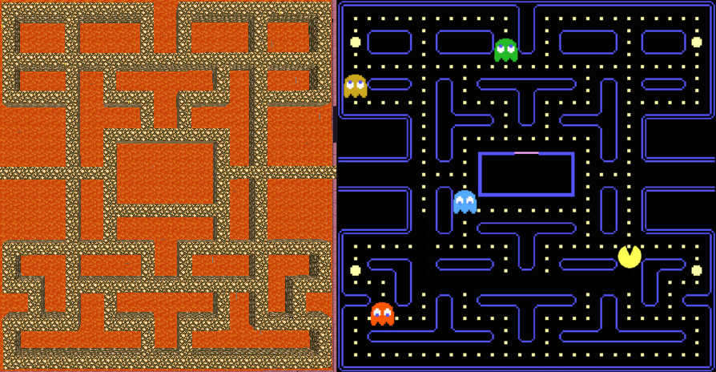
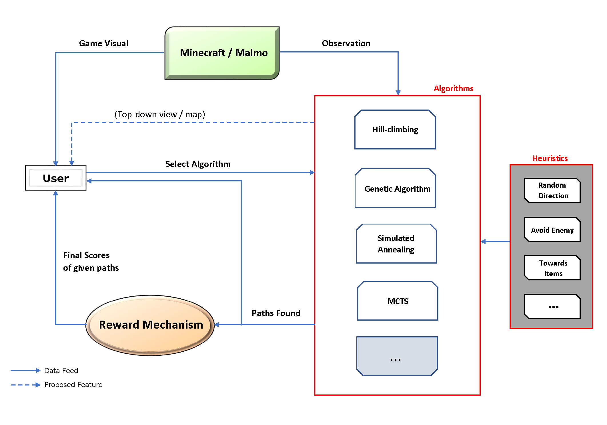

This program teaches a Minecraft agent to explore and survive in a contained but hostile environment. The environment is maze-like, containing multiple passages leading in all directions. The agent learns to move through the environment, collecting diamonds, but avoiding enemy Zombies that can knock the agent off into the lava.

Essentially, this program teaches an agent to play Pacman.

The agent is taught using various different local search algorithms; we then compare the performance of each algorithm. So far, the agent can learn to navigate its environment using a genetic algorithm, a steep hill-climbing algorithm, a greedy hill-climbing algorithm, simulated annealing, or brute force. You can see a video of the program in action below.

### Graphical Overview

### Useful Links
* **Repository:** <https://github.com/avielmenter/MinePac>
* **Malmo Platform:** <https://github.com/Microsoft/malmo>
* **Wikipedia on Genetic Algorithms:** <https://en.wikipedia.org/wiki/Genetic_algorithm>
* **N-Queens Part 1: Steepest Hill Climbing:** <http://letstalkdata.com/2013/12/n-queens-part-1-steepest-hill-climbing/>

### Video

  <iframe src="https://www.youtube.com/embed/sS253RfbM3s" frameborder="0" allowfullscreen></iframe>

