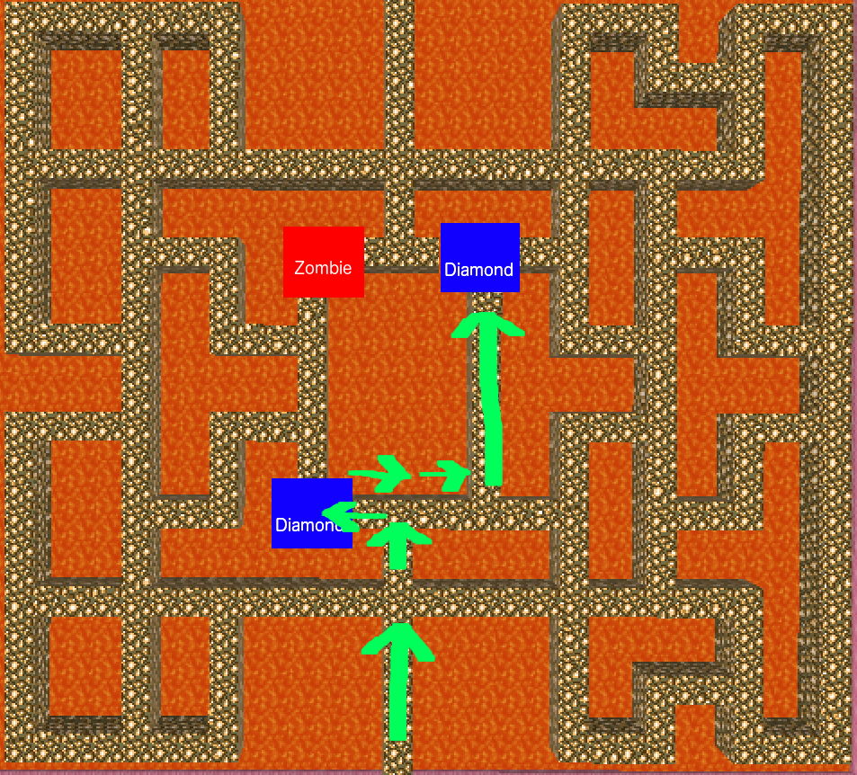
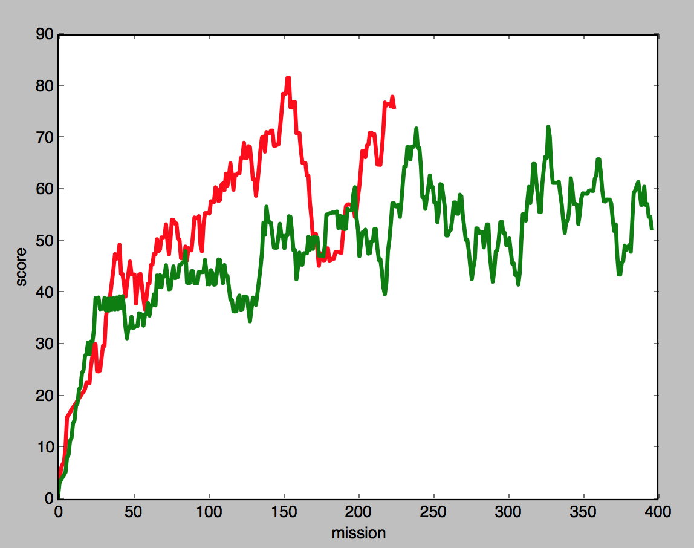

## Project Summary
This project teaches an agent to explore and survive in a contained but hostile environment. It trains the agent using multiple local search algorithms, and then compares the performance of each algorithm. Currently, both genetic and hill-climbing algorithms have been implemented, and tested in a simplified version of the final environment. This environment contains a single Zombie that the agent must avoid, as well as two diamonds that the agent can collect to maximize its score. The agent's score also improves the longer the agent stays alive.

The goals and approach for the project have remained largely unchanged since the proposal. Only a few implementation details have changed (e.g., score improves by collecting diamonds, not experience points). However, several steps still remain until the project is complete. More algorithms will be implemented, and then tested in an environment sufficiently complex that the differences between their performance are readily apparent. So far, however, the project provides a meaningful comparison between the two local search algorithms already implemented.

## Approach
Currently, the program uses two local search algorithms to navigate the environment. Each algorithm uses heuristic functions to decide which movement the agent will take. Each heuristic function takes as input the agent's observations, which include the following:

* `grid`: a 3x3 grid of blocks centered at the block below the agent's feet
* `entity_locations`: the location, in Minecraft's XYZ space, of every entity in the map, including the player, and every enemy and diamond

So far, the algorithms employ the following heuristic functions:

* `random_direction`: the agent moves in a random direction
* `away_from_enemy`: the agent moves away from the nearest zombie
* `towards_item`: the agent moves towards the nearest diamond

At each junction in the maze, the algorithm decides which heuristic function to use, and then returns the movement action generated by the heuristic. The agent then takes that action. Once the mission is complete, the agent's score is evaluated. The score is a function of the number of diamonds that the agent has collected, and the amount of time in seconds $$t$$ that the agent stayed alive. The number of diamonds collected dominates the score function. The time alive is largely included to make the score continuous, such that the agent's progress can be measured even when performance increases only marginally. Specifically, the score is calculated as:

$$ score = diamonds \cdot 50 + t $$

A mission ends when the agent has died, or automatically after 30 seconds. The score is then fed to the algorithm, which considers the score and then updates its heuristic selection function appropriately. Each algorithm has the following three functions defined in its interface:

* `__init__:` the algorithm's constructor, which takes in a list of heuristic functions that it can use
* `set_score:` informs the algorithm of the score it achieved on the latest mission
* `get_action`: returns the next move that the agent should take

So far, we have implemented a genetic algorithm and a hill-climbing algorithm. They work as follows:  

**Genetic Algorithm:**  
The genetic algorithm creates a "generation" of strings of heuristic functions. Each generation contains 20 strings. The length of the strings is determined randomly by a normal distribution with $$\mu = 8$$ and $$\sigma = 1$$. Every mission, the agent relies on the heuristic strings to determine where to move. For each move, it looks to the next heuristic in the string, and takes the move generated by that heuristic. If the agent reaches the end of the string, it starts over at the beginning of the string.

After each mission, the algorithm is updated with the score that the agent received. When the agent has gone through all strings in a generation, the algorithm takes the top 5 most high-scoring strings, and generates 20 new strings. It generates the new strings by randomly selecting from the most high-scoring strings, and then combining them at a randomly chosen crossover point. Additionally, there is a probability $$p = .05$$ that a given heuristic in a string will "mutate" into a different heuristic. The algorithm continues to repeat this process with the new generation, ideally attaining higher scores each time.  

**Hill-Climbing Algorithm:**  
Like the genetic algorithm, the hill-climbing algorithm operates on a string of heuristic functions. First, the hill-climbing algorithm runs a mission using one of these strings. As with the genetic algorithm, the agent looks to the next heuristic in the string to determine what move it should make. If it reaches the end of the string, it starts over at the beginning of the string.

After this first string has been scored, the algorithm then runs a mission for each string adjacent to the string in the search space. An adjacent string is a string differing by only one addition of a heuristic from the string, removal of a heuristic, or change of a heuristic. After scoring every adjacent string, the algorithm chooses the string with the best score. It then explores the adjacent strings to that string, choosing the best one of those, and so on. These incremental improvements allow the algorithm to find heuristic strings that produce higher and higher scores.

## Evaluation
As the goal of this project is to provide comparative data about different local search algorithms, the project should be evaluated based on the insight the comparative data provide. Currently the environment is simple enough that even degenerate algorithms are able to achieve moderate scores. A comprehensive performance analysis will therefore require more data. However, existing observations about the performance of each algorithm still provide a meaningful basis for evaluating the progress of the project so far.

Both the hill-climbing and genetic algorithms converge to similar solutions. This suggests that the solution they find isn't merely random, but is optimal for the environment. Indeed, examining the environment, it is easy to see how a sequence in which the agent moves towards the nearest diamond three times, then away from the enemy once or twice, then towards the next diamond until it captures it, would produce the best score. Bot the genetic and hill-climbing algorithms converge on this sequence.

Because the genetic and hill-climbing algorithms can identify this sequence as optimal, they can achieve higher peak performance than an algorithm that just mindlessly moves towards the nearest diamond at all times. Such an algorithm has no way of exceeding a score of around 50, because agent will always be immediately killed by the Zombie after capturing the first diamond. However, both the genetic and hill-climbing algorithms spend much of their time exploring suboptimal sequences. This means that, although they achieve higher peak performance their average performance is not substantially improved over the performance of a degenerate algorithm.

  The red line tracks the performance of the genetic algorithm, the green line tracks the performance of the hill-climbing algorithm, and the blue line tracks the performance of the baseline degenerate algorithm.  

Indeed, if we compare the means and standard deviations of the scores of the different algorithms, we see that though the genetic and hill-climbing algorithms have a slightly lower average than our simple baseline algorithm, their standard deviation (and therefore peak performance levels) are higher.

<table style="text-align: center; margin-left: auto; margin-right: auto;" class="alg_data">
    
    <tr>
        <th>Algorithm</th>
        <th>Mean Score</th>
        <th>Standard Deviation</th>
    </tr>
    <tr>
        <th>Baseline</th>
        <td>56</td>
        <td>19</td>
    </tr>
    <tr>
        <th>Hill-Climbing</th>
        <td>49</td>
        <td>34</td>
    </tr>
    <tr>
        <th>Genetic</th>
        <td>56</td>
        <td>35</td>
    </tr>
</table>
 

As we test the algorithm in more and more complex environments, average performance differences should become more stark. A simple algorithm will likely be unable to achieve reasonable performance in a complex environment. Furthermore, while currently heuristic strings that are only slightly suboptimal have near-random performance, in a more complex environment with longer heuristic strings, a slightly suboptimal string will likely have much better than random performance. As the project progresses, we will therefore have more insightful comparative data with which we can analyze these algorithms.

## Remaining Goals and Challenges
The algorithms implemented so far have shown themselves up to the task of teaching the agent to navigate this simple environment. However, metrics of their performance are currently dominated by noise. There are a few techniques we would like to employ before the final report to minimize this problem. Currently, Zombie movement is continuous, while agent movement is discrete. This leads to inconsistencies; sometimes the Zombie catches up to the agent, and sometimes it doesn't.  Implementing turn-based movement, these inconsistencies should disappear, and performance will be more consistent.

We would also like to test the algorithms in different environments, with different numbers of diamonds to collect, different numbers of enemies, and a different layout. First, such comparative testing will demonstrate the robustness of the algorithms. It will show that they can solve more than just one maze. Second, testing the algorithms in different mazes will provide more data with which to compare the algorithms. It could, for example, be the case that some algorithms perform better in some mazes than others.

Finally, we plan to implement and test a greater number of algorithms. Some algorithms, such as a simulated annealing algorithm, have already been coded; there just was not enough time run a longer test on them before the progress report. Other algorithms may simply be variations on ones already implemented. For example, we may compare the success of the genetic algorithm with different population sizes, or the success of a simulated annealing algorithm with different cooling rates. This goal is probably the most essential to the project. As the purpose of the project is to provide an insightful comparison between various different local search algorithms, we need multiple local search algorithms to compare.

## Video
<iframe style="width: 100vw; height: 56.25vw;" src="https://www.youtube.com/embed/OEJmt3fIFSU" frameborder="0" allowfullscreen></iframe>
